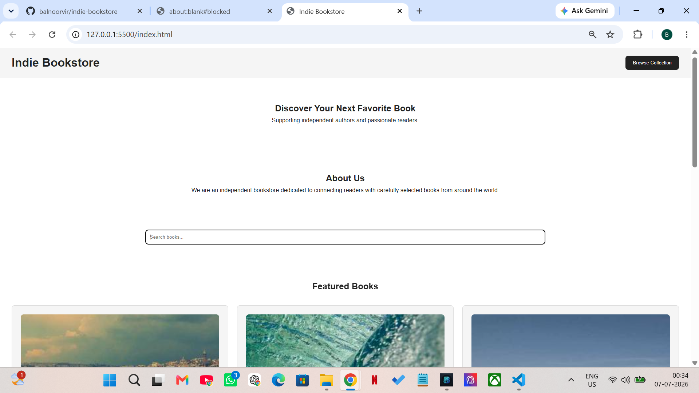
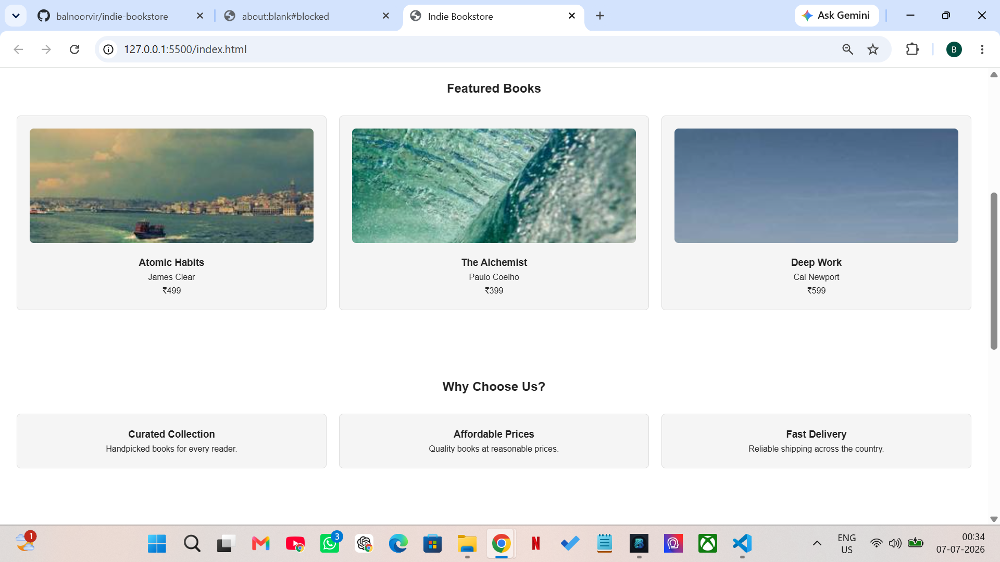
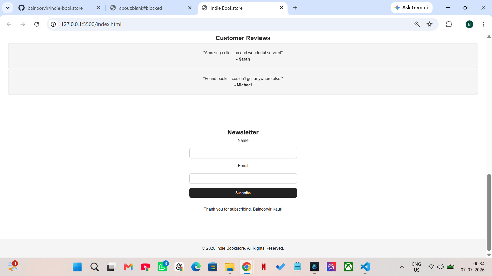
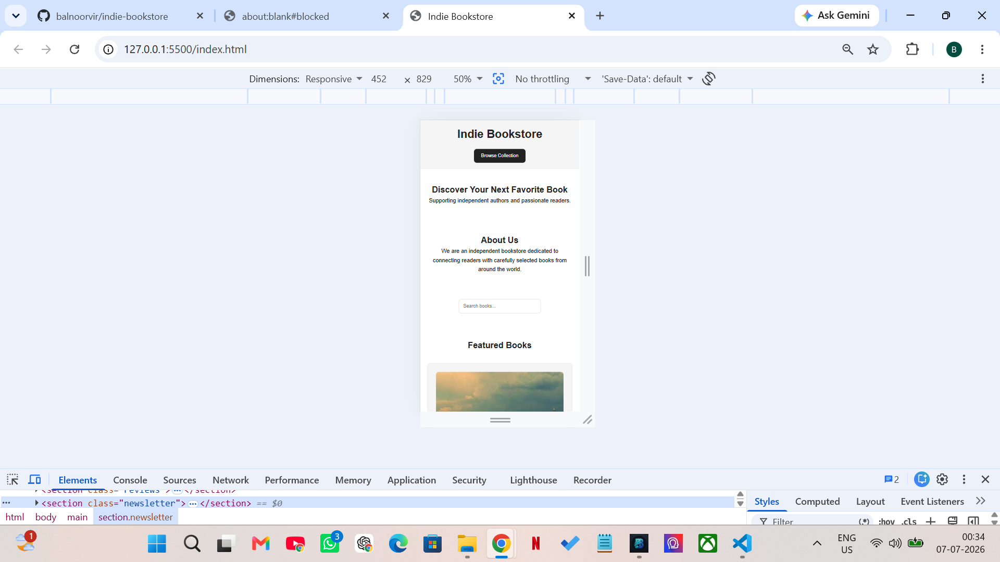
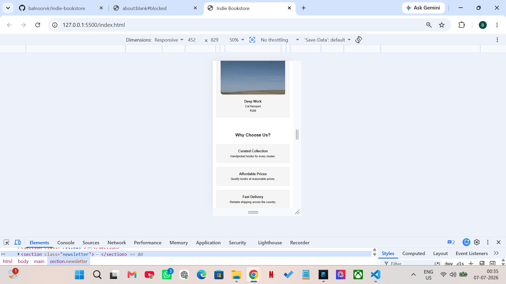

# Indie Bookstore Landing Page

A responsive static landing page built using HTML5, CSS3, and Vanilla JavaScript.

## Features

- Responsive layout
- Semantic HTML5
- Newsletter form validation
- Empty state handling
- Loading indicator simulation
- XSS input sanitization
- Accessibility-friendly labels
- Analytics console logging

## Technologies

- HTML5
- CSS3
- JavaScript

## Live Website Link
https://indie-bookstore-beta.vercel.app/

## Screenshots

